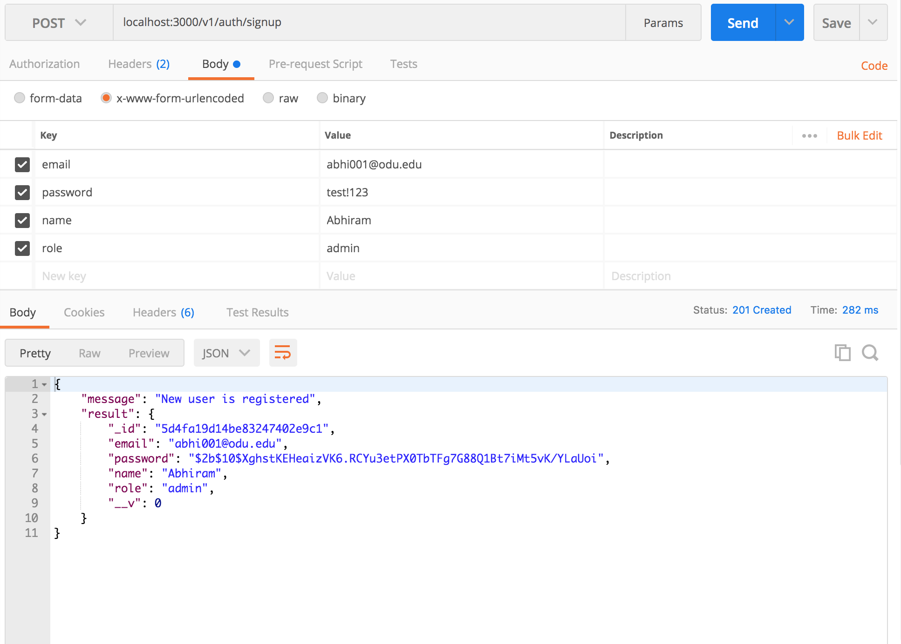
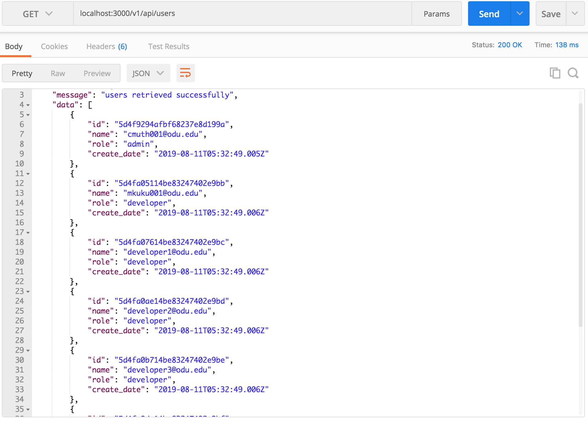

# Secure-REST-API-NodeJS

## Signup
|   |  |
|:---:|:---:|
| Admin Signup | Developer Signup | 

## Login

### Admin Login

|   |
|:---:|
| Admin Login |

Admin have access to get all the users(admin/developers) in the database.

|   |
|:---:|
| All Users |

Admin role have access to delete the users in the table

|   |
|:---:|
| Access to delete user |

### Developer Login

|   |
|:---:|
| Developer Login |

Developer can get all the users with role developer

|   |
|:---:|
| Developer Users |

Developer does not have access to delete user

|   |
|:---:|
| Access Denied |

I hope this tutorial helped you in creating a simple **Secure REST API using NodeJs and Mongodb**. To Know more about how to create  a simple REST API click [here](https://github.com/cmuth001/REST-API-Express-Node-MongoDB).
